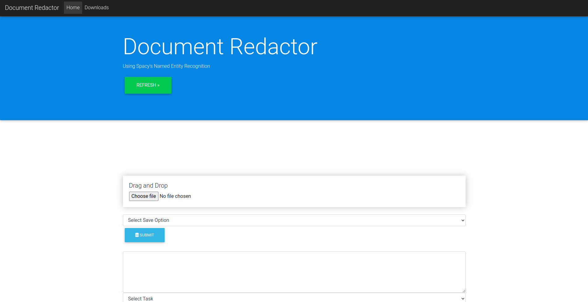
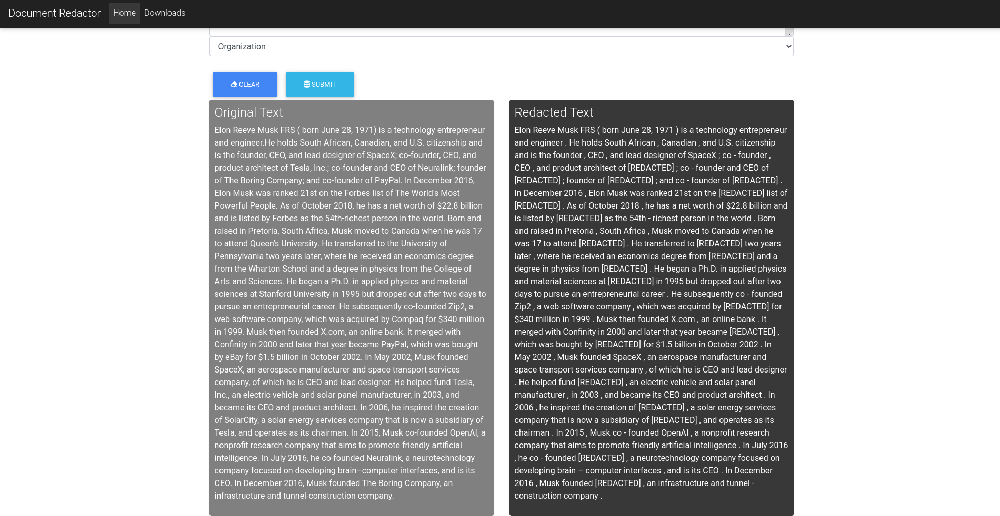

# NLP Miniproject 2022-23
📜 A Flask app that uses Python spaCy's named entity recognition to redact text & text documents  
📜 Stack: Flask, spaCy  

👨‍💻 Developer
===============
Built with ❤︎ by Gandharv More